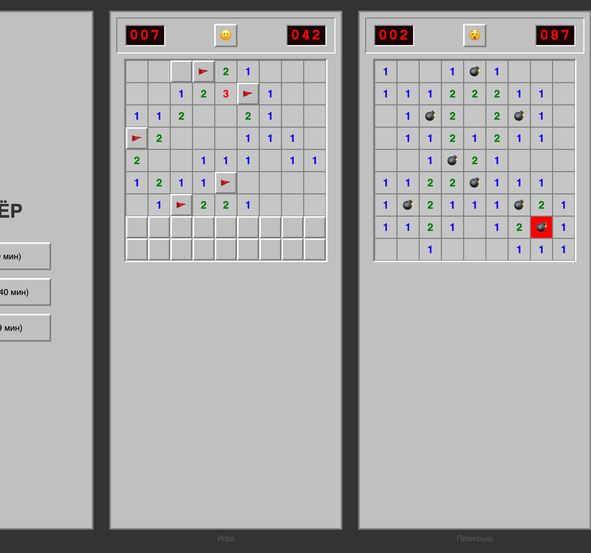

# 💣 Сапёр (Minesweeper)

Классический Сапёр в стиле Windows XP, написанный на Godot 4.4.1.

## Платформа
- Смартфоны, портретная ориентация
- Целевое разрешение: 1080×2400 (логическое ~440×980 dp)

## Управление

### Тачскрин (смартфон)
- **Тап** — открыть клетку
- **Долгий тап** — поставить/снять флаг
- **Двойной тап** — поставить/снять флаг
- **Очень долгий тап (1.2с)** — открыть все соседние клетки (chord)

### Мышь (десктоп)
- **Левый клик** — открыть клетку
- **Правый клик** — поставить/снять флаг
- **Двойной клик** — поставить/снять флаг
- **Долгое нажатие (1.2с)** — открыть все соседние клетки (chord)

## Уровни сложности
| Уровень | Поле | Мины |
|---------|------|------|
| Новичок | 9×9 | 10 |
| Любитель | 16×16 | 40 |
| Профи | 16×30 | 99 |

## Сборка
Открыть проект в Godot 4.4.1 и экспортировать под нужную платформу.
